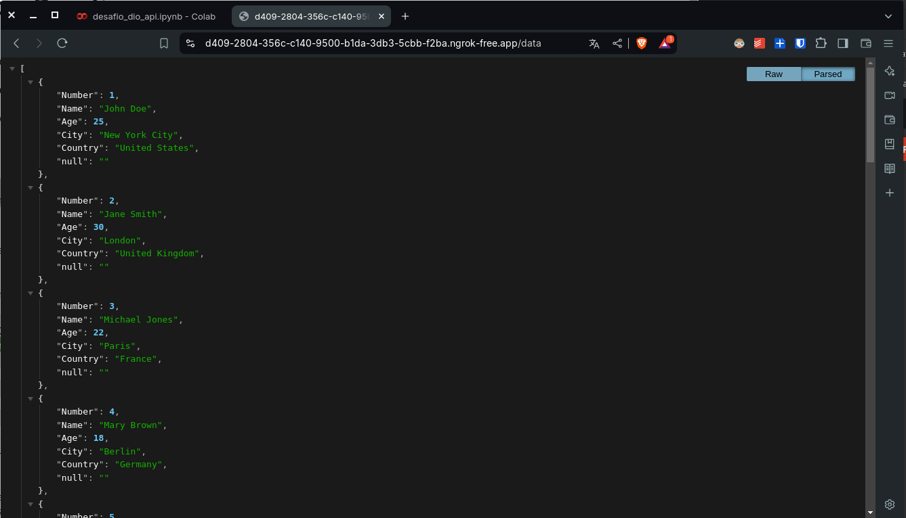
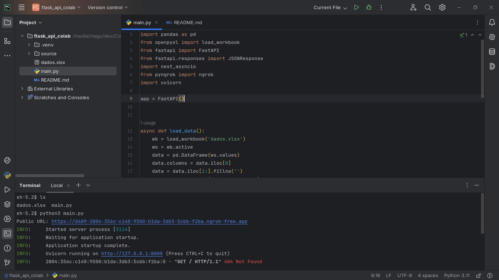

# API chalenge DIO em Python

## Sobre o desafio
Para este projeto o desafio final envolve a entrega de uma API desenvolvida no framework Flask utilizando a Plataforma COLAB. O Objetivo principal está relacionado com a leitura de uma planilha de dados no formato JSON utilizando uma API no ambiente de desenvolvimento colaborativo COLAB.

## Link entregável
Google Colab:
https://colab.research.google.com/drive/1fNfdfmliuxyG4b9StZ4sNEsir271ULxU?usp=sharing

| A tabela está dentro deste repositório e dentro do Google Colab

## Libs utilizadas
- Pandas
- Openpyxl
- FastAPI
- nest_asyncio
- Pyngrok
- Uvicorn

## Nota:
Este repositório também possui o código posto no link.

## Imagem:

